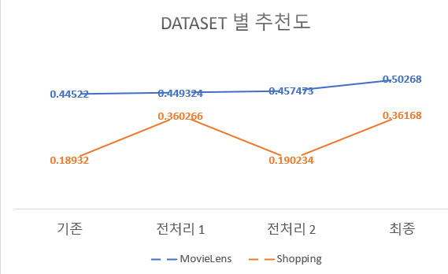

# 사용자 기반 autoencoder 전처리 개선
기존의 H+Vamp Gated 모델의 추천도를 전처리 개선을 통하여 추천도를 높였습니다.
  H+vamp Gated 논문 https://paperswithcode.com/paper/enhancing-vaes-for-collaborative-filtering
  H+vamp Gated github https://github.com/psywaves/EVCF
  실험 결과
 

